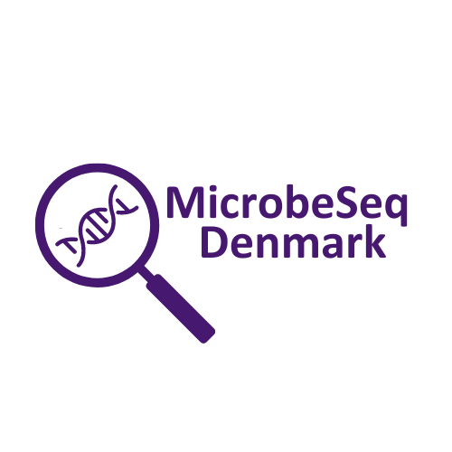

# 🧬🇩🇰 MicrobeSeq Denmark (also known as SSI-Seq)

Welcome to the official landing page for the MicrobeSeq Denmark project. This is the central hub for all repositories related to our research and development.

Apologies but this page is still in the works so details aren't available yet but will be made aviable here in the future!

SSI-Seq is supported by co-funding from the European Union’s EU4Health programme under Grant Agreement Nr 101111879. Views and opinions expressed do not necessarily reflect those of the European Union or HaDEA. Neither the European Union nor the granting authority can be held responsible for them.

© 2023 MicrobeSeq Denmark. All rights reserved.

[Landing Zones](https://github.com/ssi-dk/landingzones) - To track and enable data transfers between our multiple servers

[uQCme](https://github.com/ssi-dk/uqcme) - Runs QC rules and visualizes them
