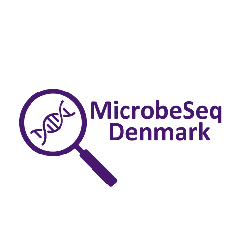
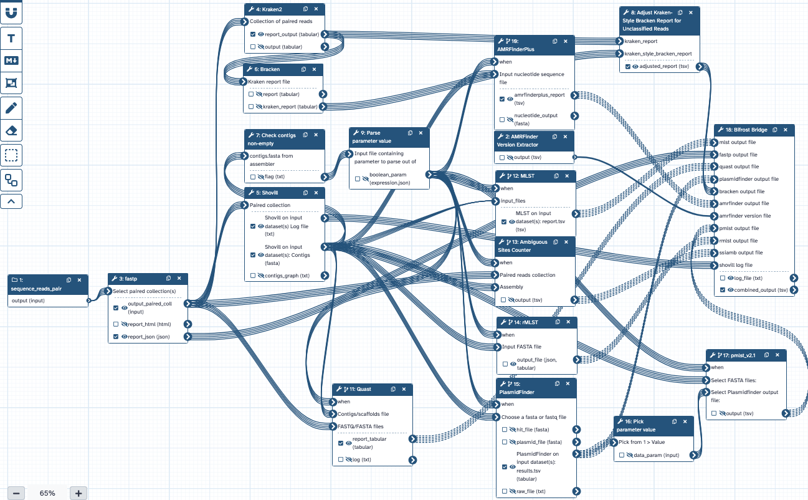
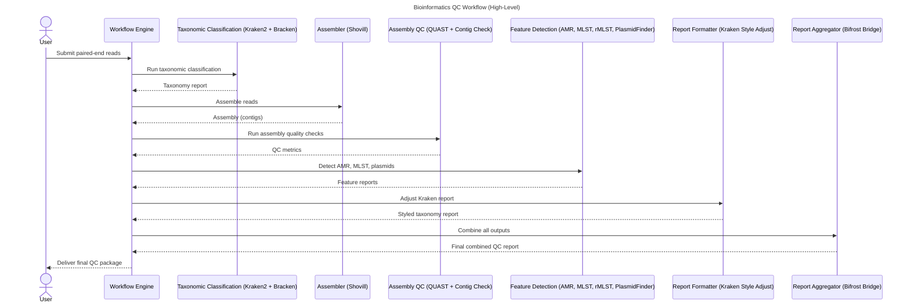

# 🧬🇩🇰 MicrobeSeq Denmark (also known as SSI-Seq)

Welcome to the official landing page for the MicrobeSeq Denmark project. This is the central hub for all repositories related to our research and development.

Apologies but this page is still in the works so details aren't available yet but will be made aviable here in the future!

SSI-Seq is supported by co-funding from the European Union’s EU4Health programme under Grant Agreement Nr 101111879. Views and opinions expressed do not necessarily reflect those of the European Union or HaDEA. Neither the European Union nor the granting authority can be held responsible for them.

## [Lab protocols](https://www.protocols.io/researchers/sekventeringsenheden-sb/publications)

>[Fast Track - Nanopore - SSI](dx.doi.org/10.17504/protocols.io.e6nvwd3n2lmk/v1) 
> 
> Protocol for the 'fast track' sequencing flow at the Sequencing Core Facility at Statens Serum Institut (SSI). This method utilises the MagLEAD system for DNA extraction and cleaning followed by the Nanopore sequencing platform for library prep. (Kit: SQK-RBK114-96) and sequencing (GridION w. flow cell type: FLO-MIN114). Both isolates and cleaned up DNA can be used as input material. 
Note, this protocol is in Danish. (🇩🇰) 

> [Bakterial WGS - SSI](dx.doi.org/10.17504/protocols.io.5qpvo3r7bv4o/v1) 
> 
> Method used at Sequencing Core Facility - Statens Serum Institut for sequencing of bacterial isolates. 
This protocol is specified for high-throughput sequencing of 96 isolates (sometimes less depending on the number of  isolates with large genomes). Furthermore, the genomes are sequenced on the Illumina sequencing platform using a MiSeq and the MiSeq 500-cycle v2 kit. Note, this protocol is in Danish. (🇩🇰) 

> [Covid sekventering - SSI](dx.doi.org/10.17504/protocols.io.j8nlkwqw6l5r/v1)
> 
> Method used at Statens Serum Institut for detection and sequencing of SARS-CoV-2 from saliva tests. 
This protocol is specified for high-throughput sequencing of 384 samples - 376 positive SARS-CoV-2 samples + 8 control samples divided into four 96-well PCR plates. Furthermore, the samples are sequenced on the Illumina sequencing platform using a NextSeq 550. Note, this protocol is in Danish. (🇩🇰) 

This list is not exhaustive.

## Software

### QC pipeline

```mermaid
sequenceDiagram
    title Bioinformatics QC Workflow (High-Level)

    actor User
    participant WF as Workflow Engine
    participant Tax as Taxonomic Classification (Kraken2 + Bracken)
    participant Asm as Assembler (Shovill)
    participant QC as Assembly QC (QUAST + Contig Check)
    participant Feat as Feature Detection (AMR, MLST, rMLST, PlasmidFinder)
    participant Format as Report Formatter (Kraken Style Adjust)
    participant Agg as Report Aggregator (Bifrost Bridge)

    User ->> WF: Submit paired-end reads
    WF ->> Tax: Run taxonomic classification
    Tax -->> WF: Taxonomy report

    WF ->> Asm: Assemble reads
    Asm -->> WF: Assembly (contigs)

    WF ->> QC: Run assembly quality checks
    QC -->> WF: QC metrics

    WF ->> Feat: Detect AMR, MLST, plasmids
    Feat -->> WF: Feature reports

    WF ->> Format: Adjust Kraken report
    Format -->> WF: Styled taxonomy report

    WF ->> Agg: Combine all outputs
    Agg -->> WF: Final combined QC report

    WF -->> User: Deliver final QC package
```

> [Landing Zones](https://github.com/ssi-dk/landingzones)
>
> To track and enable data transfers between our multiple servers

> [uQCme](https://github.com/ssi-dk/uqcme)
>
> Runs QC rules and visualizes them

© 2023 MicrobeSeq Denmark. All rights reserved.
